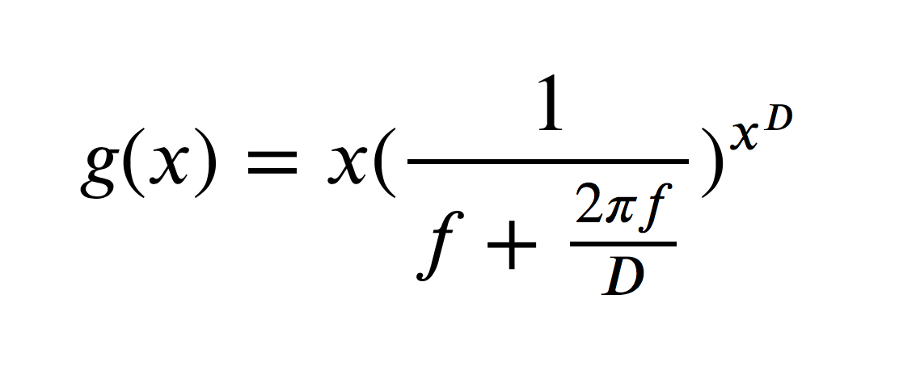

# Retina
Python code for generating retina tessellations

## Dependencies

* PyFlann
* Matplotlib
* Scipy
* Numpy

## Algorithms
* Self Similar Neural Network (with flann optimization and barycentric subdivision)
* Fibonacci
* Hybrid

## Self Similar Neural Network
A Python implementation of the self similar neural network that offers various fast nearest neighbour backends to speedup training time.
### Backends
* Scipy cdist - Efficient CPU brute force nearest neighbour search. Only appropriate for small node counts (<1500)
* PyFlann - Fast approximate nearest neighbour search that scales well to a large number of points

### Use

#### Initialisation:
SSNN is treated as a python object and is initialized with the following paramaters

```python
from Tessellation.SSNN import SSNN

ret = SSNN(n_nodes, fovea, method='auto')
```
* n_nodes: the number of the nodes/receptive fields in the tessellation
* fovea: the radius of the fovea (between 0 and 1)
* method: the nearest neighbours method to be used. By default this is 'auto' which automatically chooses the fastest method based on the node count. Methods available are 'flann' and 'default' which use PyFlann and Scipy cdist respectively. (Can also provide a pytorch backend for GPU accelerated neighbour search in future release if needed)

#### Annealing:

After instantiating the SSNN the points need to be annealed to a pseudo-uniform state. This can be achieved by calling the fit or generative_fit methods.

fit runs the standard SSNN learning algorithm to anneal the weights. (Clippingdale & Wilson)

```python
ret.fit(num_iters=20000, initial_alpha=0.1, final_alpha=0.0005, verbose=True)
````

* num_iters: number of training iterations that are performed (Equivalent to epochs in traditional neural network training).
* initial_alpha: the starting learning rate of the SSNN
* final_alpha: the value that the learning rate decays to by the end of training.
* verbose: boolean value, displays training progress in std out if True.

Alternatively it is possible to use the generative_fit method that uses barycentric subdivision to generate new points over the course of training allowing for a factor 4 speed increase in training at the expense of a less uniform final tessellation.

```python
ret.generative_fit(steps, num_iters=20000, initial_alpha=0.1, final_alpha=0.0005, verbose=True)
``` 

* steps: the number of times barycentric subdivision is performed. Diminishing returns as step size increases, recommend 1 or 2 subdivisions at most.
* initial_alpha: the starting learning rate of the SSNN
* final_alpha: the value that the learning rate decays to by the end of training.
* verbose: boolean value, displays training progress in std out if True.

#### Set Custom Weights:

You may also want to set the initial weights yourself such as in the case of the hybrid retina described below. this can be done with the set_weights method.

```python
ret.set_weights(X)
```
* X: is an nx2 numpy array of points in cartesian coordiantes

#### Retrieving Tessellation:

After the training the SSNN you will want to get your weights for use in the Software Retina. This can be achieved simply by accessing the weight variable of the instantiated SSNN.

```python
tessellation = ret.weights
```

This is an nx2 numpy array of the current weights of the SSNN in cartesian coordinates

## Fibonacci
Uses the golden ratio to calculate a uniform point distribution and then dilated with a dilating function to give a centre foveated retina topography. Unlike the SSNN these are functions, not objects. The following functions are available for use

```python
From Tessellation.fibonacci import fibonacci_retina, hybrid, fibonacci_sunflower
```

#### fibonacci_sunflower: 

This function uniformly generate points in a unit circle with no fovea, this is primarily used by the fibonacci retina but may be useful if you want to define your own function that transforms the uniform points to a foveated distribution of points

```python
tessellation = fibonacci_sunflower(n_nodes)
```

* n_nodes: the number of points in the tessellation. (Same as SSNN)

#### fibonacci_retina:
This function applies a dilating function to the fibonacci_sunflower points to produce a centre foveated distribution of points within a unit circle

```python
tessellation = fibonacci_retina(n_nodes, fovea, foveal_density)
```
* n_nodes: the number of points in the tessellation. (Same as SSNN)
* fovea: the radius of the fovea (between 0 and 1)
* foveal_density: Determines the ratio of points inside and outside the fovea without changing the size of the fovea. The value it takes is NOT a ratio. Higher values equate to more nodes in the fovea. A value of 1.6 for foveal density approximates the foveal density of the standard SSNN.

#### hybrid:
This function initializes the SSNN weights with a fibonacci retina and anneals for 3000 iterations to enforce a pseudo uniform structure in the fibonacci retina.

```python
tessellation = hybrid(n_nodes, fovea, foveal_density, verbose=True)
```
* Same paramaters as the fibonacci_retina as well as a verbose paramater which is the same as the verbose paramater in SSNN.fit


## Dilating Function
By applying the following function to the rho coordinate, for each point in it's polar form, each point can be dilated to give the whole retina a centre foveated structure




<a href="https://www.codecogs.com/eqnedit.php?latex=g(x)&space;=&space;x\left&space;(&space;\frac{1}{f&space;&plus;&space;\frac{2\pi&space;f}{D}}&space;\right&space;)^{x^{D}}" target="_blank"></a>
