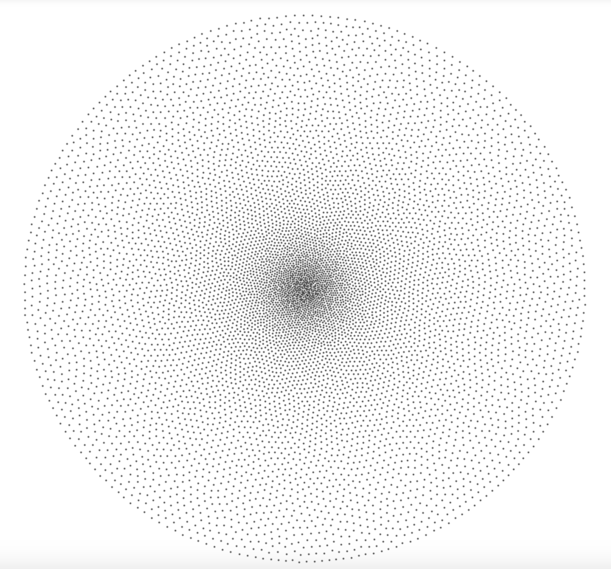
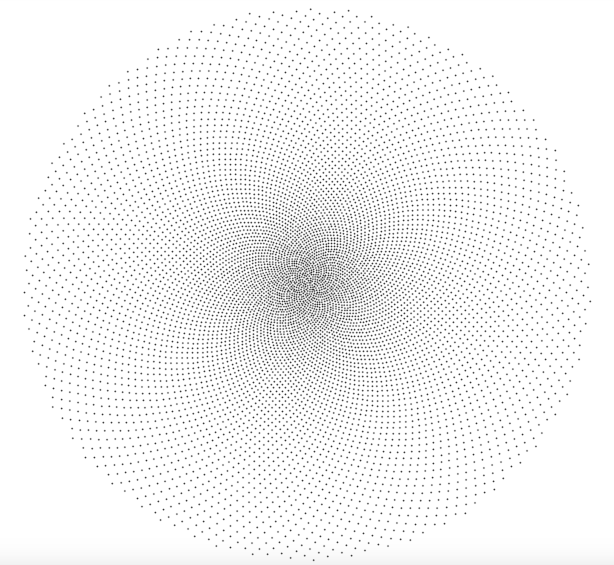

# Retina
A software suite for generating retina tessellations

## Requirements

* PyFlann
* PyTorch
* Matplotlib
* Scipy
* Numpy

## Algorithms
* Self Similar Neural Network (with flann optimization and barycentric subdivision)
* Fibonacci
* Hybrid

## Self Similar Neural Network
A Python implementation of the self similar neural network that offers various fast nearest neighbour backends to speedup training time.
### Backends
* Scipy cdist - Uses a vectorized euclidean distance between two matrices of points for very fast nearest neighbour search on CPU for a small number of points.
* PyFlann - Fast approximate nearest neighbour search that scales well to a large number of points
* PyTorch - A vectorized euclidean distance calculation that runs on gpu, very fast even for large number of points (Max number of points currently limited by GPU available memory).

## Fibonacci
Uses the golden ratio to calculate a uniform point distribution and then dilated with a dilating function to give a centre foveated retina topography.

